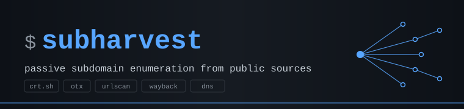

Passive subdomain enumeration from public sources. Active probing optional, never default.

Author: SkyzFallin

## What It Does

`subharvest` aggregates subdomains for a target apex domain by querying certificate transparency logs, passive DNS providers, web archives, and the target's own zone records. It deduplicates findings, validates them on demand, and outputs structured results with **provenance** — every subdomain carries the list of sources that returned it.

The target sees zero traffic from the operator unless `--active` is explicitly set. With passive sources only, you're querying third-party APIs about the target, not the target itself.

## Quick Start

`subharvest` isn't on PyPI yet — install directly from GitHub:

```bash
# Recommended: isolated install via pipx
pipx install git+https://github.com/SkyzFallin/subharvest.git

# Or from a local clone
git clone https://github.com/SkyzFallin/subharvest.git
cd subharvest
pipx install .

# Or for development (editable install)
pipx install -e .
```

Then:

```bash
# Default: query all no-key passive sources, JSON to stdout
subharvest example.com

# Plaintext list — pipe into httpx, nuclei, etc.
subharvest example.com --format txt

# Resolve every finding, write a Markdown report
subharvest example.com --resolve -o report.md --format md

# Only one source, with verbose source-by-source trace
subharvest example.com --only crtsh -v

# See what's available
subharvest --list-sources
```

## Sources (v0.1)

| Source | Kind | Requires Key |
|---|---|---|
| `crtsh` | Certificate Transparency | no |
| `otx` | AlienVault OTX passive DNS | no |
| `urlscan` | urlscan.io search index | no |
| `wayback` | Wayback Machine CDX | no |
| `dns_records` | Target's own SOA/NS/MX/SPF/DMARC | no |

API-key sources (`securitytrails`, `virustotal`, `censys`, `google_ct`) are scaffolded for v0.2. Active sources (`bruteforce`, `permutation`, `axfr`) are scaffolded for v0.3.

## Output Formats

| Format | Flag | Use |
|---|---|---|
| JSON | `--format json` (default) | Structured, full provenance + per-source telemetry |
| Plaintext | `--format txt` | One subdomain per line, sorted, deduplicated |
| CSV | `--format csv` | Spreadsheet workflows |
| Markdown | `--format md` | Human-readable engagement report |

## Usage Options

```
subharvest <domain> [flags]

Sources:
  --active                   Enable active discovery (brute force, permutation, AXFR)
  --skip <source>            Skip a specific source (repeatable)
  --only <source>            Only use this source (repeatable)
  --list-sources             Print all available sources and exit

Active mode (v0.3):
  --wordlist <path>          Custom DNS brute force wordlist
  --permutations <path>      Custom permutation list
  --no-permute               Disable permutation even in active mode
  --threads <n>              Brute force concurrency (default: 50)

Validation:
  --resolve                  Resolve each subdomain after collection
  --resolver <ip>            Custom DNS resolver IP
  --doh                      Use DNS-over-HTTPS

Output:
  --format <json|txt|csv|md> Output format (default: json)
  -o, --output <path>        Write to file
  --quiet                    Suppress progress output
  -v, --verbose              Show per-source query trace

Config:
  --config <path>            Custom config file (default: ~/.subharvest/config.toml)
  --no-color                 Disable ANSI color
  --version                  Print version and exit
```

## Auto-saved Artifacts

Every run automatically writes a plaintext list of subdomains to `./output/<domain>-<timestamp>.txt` in the current working directory, regardless of `--format` or `-o`. This way piping JSON to another tool still leaves you a usable file artifact.

```text
$ subharvest example.com
... output ...
artifact: output/example.com-20260509-091530.txt
```

Disable with `--no-auto-output`. Change the directory with `--output-dir <path>`.

## Notes

- **Wildcard handling.** Before resolution, `subharvest` probes the apex with random nonsense subdomains. If they resolve, it captures the wildcard fingerprint (IPs, CNAMEs) and marks matching findings as `filtered_wildcard: true` in JSON output. Filtered entries are not silently dropped — the operator can audit what was filtered.
- **SaaS CNAME flagging.** When `--resolve` is set, findings whose CNAMEs point to known SaaS providers (`*.cloudfront.net`, `*.github.io`, `*.azurewebsites.net`, etc.) are flagged via `saas_cname`. v0.4 will add live takeover-candidate detection.
- **API keys.** Read from `~/.subharvest/config.toml` or `SUBHARVEST_<SOURCE>_API_KEY` env vars. Sources without keys are skipped with a notice — the tool runs without any keys.
- **Run on your jumpbox.** Passive sources query third-party APIs that log requester IPs. To avoid leaking your home/office IP into provider telemetry, run from a jumpbox in the engagement environment.
- **Rate limits.** Each source has conservative defaults. Local cache (v0.2) will avoid re-hitting sources within an hour for the same domain.

## Authorized Use Only

Built for authorized recon on engagements you have permission to conduct. Passive sources query third-party APIs about the target — not the target itself — but operators remain responsible for scope and authorization, especially when `--active` is engaged. Don't point this at infrastructure you don't have written permission to assess.

## Changelog

- **v0.1.0** — MVP. crt.sh, OTX, URLScan, Wayback, DNS records source. Wildcard detection. JSON/TXT/CSV/MD output. `--resolve` flag with SaaS CNAME flagging.

## Roadmap

- **v0.2** — SecurityTrails, VirusTotal, Censys, Google CT. Local cache with TTL. TOML config schema.
- **v0.3** — Active mode: DNS brute force, permutation engine, AXFR attempt. Threading + rate limit controls.
- **v0.4** — Batch mode (`-f domains.txt`). Takeover candidate flagging. Diff mode (delta against previous run).
- **v0.5** — ASN-adjacent domain discovery. Integration with phishprint. httpx/nuclei pipe-friendly adapters.

## Credits

### Prior Art

`subharvest` sits in a well-trodden category. These tools shaped what passive subdomain enumeration looks like and are worth knowing about:

- [subfinder](https://github.com/projectdiscovery/subfinder) — ProjectDiscovery, Go.
- [amass](https://github.com/owasp-amass/amass) — OWASP, Go. Deep active enumeration.
- [assetfinder](https://github.com/tomnomnom/assetfinder) — tomnomnom, Go. Minimalist.
- [findomain](https://github.com/findomain/findomain) — Findomain, Rust.
- [sublist3r](https://github.com/aboul3la/Sublist3r) — Python, no longer actively maintained but established many conventions.

`subharvest` is independent code (no fork, no copy) — but the category exists because of these tools.

### Data Providers

The passive sources query third-party services. Without them this tool has nothing to aggregate:

- [crt.sh](https://crt.sh) by Sectigo — Certificate Transparency search.
- [AlienVault OTX](https://otx.alienvault.com) — passive DNS.
- [urlscan.io](https://urlscan.io) — URL scan index.
- [Internet Archive Wayback Machine](https://web.archive.org) — CDX index.

### Libraries

Built on:

- [`httpx`](https://www.python-httpx.org/) — async HTTP client.
- [`dnspython`](https://www.dnspython.org/) — async DNS resolver.
- [`typer`](https://typer.tiangolo.com/) + [`rich`](https://rich.readthedocs.io/) — CLI and terminal output.
- [`respx`](https://lundberg.github.io/respx/) + [`pytest`](https://docs.pytest.org/) — test suite with mocked HTTP.

## Project Hygiene

- Python 3.11+, async-first (`httpx`, `dnspython.asyncresolver`).
- Source interface in `subharvest/sources/base.py` — adding a new source is a single class with one `async def fetch(domain) -> list[Finding]`.
- Tests use canned fixtures in `tests/fixtures/`. No live API calls in the test suite.
- Run tests with `pytest -q`.

## AUDIT.md

See [AUDIT.md](AUDIT.md) for code-quality, security, and feature-backlog notes.

## License

MIT — see [LICENSE](LICENSE).
